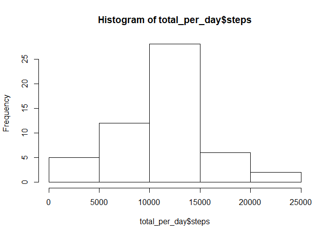
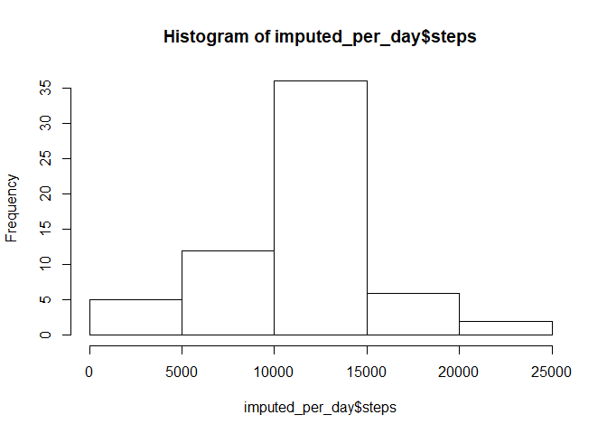

## Loading and preprocessing the data


```r
dat <- read.csv("activity.csv")
```

## What is mean total number of steps taken per day?
Calculates the total steps per day, and creates a histogram. Then reports the mean and median.


```r
total_per_day <- aggregate(steps ~ date, dat, sum)
hist(total_per_day$steps)
```

<!-- -->

```r
mean(total_per_day$steps)
```

```
## [1] 10766.19
```

```r
median(total_per_day$steps)
```

```
## [1] 10765
```

## What is the average daily activity pattern?
Makes a time series plot of the average number of steps taken versus inteval. Then provides the interval with the highest number of steps.


```r
average_per_day <- aggregate(steps ~ interval, dat, mean)
with(average_per_day, plot(interval, steps, type="l"))
```

<!-- -->

```r
average_per_day$interval[[which.max(average_per_day$steps)]]
```

```
## [1] 835
```

## Imputing missing values
Replaces NA values for the number of steps with the average value for the same interval. Then creates a histogram. Finally reports the mean and median for the imputed steps data.


```r
# Calculate and report the sum
sum(is.na(dat$steps))
```

```
## [1] 2304
```

```r
## Impute the data based on the mean for each interval
# Helper function to return the average steps for a given interval
find_average <- function(x) {
    ind <- which(average_per_day$interval == x)
    average_per_day$steps[ind]
}
# Create a new dataset, and add a column for the average steps at a certain interval
imputed_dat <- dat
imputed_dat$average <- sapply(dat$interval, find_average)

# Replace NA values with the average
na_indices <- which(is.na(dat$steps))
imputed_dat$steps[na_indices] <- imputed_dat$average[na_indices]


# Make a histogram and report the mean and median
imputed_per_day <- aggregate(steps ~ date, imputed_dat, sum)
hist(imputed_per_day$steps)
```

<!-- -->

```r
mean(imputed_per_day$steps)
```

```
## [1] 10766.19
```

```r
median(imputed_per_day$steps)
```

```
## [1] 10766.19
```

## Are there differences in activity patterns between weekdays and weekends?
Make separate times series graphs (steps versus interval) for the weekdays and weekends.


```r
# Add column for weekdays
imputed_dat$weekday <- weekdays(strptime(imputed_dat$date, "%Y-%m-%d"))
imputed_dat$weekday <- sapply(imputed_dat$weekday, function(x) ifelse(x %in% c("Saturday", "Sunday"), "Weekend", "Weekday"))
imputed_dat$weekday <- as.factor(imputed_dat$weekday)

# Calculate averages
weekday_averages <- aggregate(imputed_dat$steps, by = list(imputed_dat$interval, imputed_dat$weekday), mean)
names(weekday_averages) <- c("interval", "weekday", "steps")

# Make graph
library(lattice)
xyplot(steps ~ interval | weekday, weekday_averages, type = "l", layout = c(1,2))
```

<!-- -->
